# GENESIS

*A world is waiting for its god.*

GENESIS is a browser god-game on a small living planet. Nothing is scripted:
plates raise mountains, rain carves rivers, climate paints biomes, herds graze
and are hunted, and tribes of individually simulated people settle, farm,
trade, pray, marry, fall sick, go to war and remember what their god did to
them. You shape it all from above with twenty divine powers and a set of
terraforming brushes — and your deeds become their scripture.

Everything you see is generated at load time from a seed: terrain, textures,
meshes, clouds, stars, names, flags, music and sound. There are no asset files.

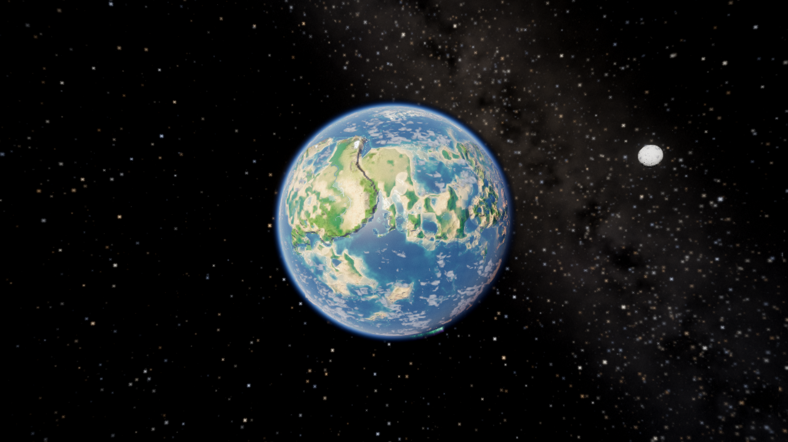

## Run it

```bash
npm install
npm run dev        # http://localhost:5173
npm run build      # type-check and production build into dist/
npm test           # fast test suites (Vitest)
npm run test:soak  # 500-year soak + every scenario won and lost by scripted players
npm run shots      # regenerate docs/screenshots (headless Chromium, SwiftShader)
npm run monkey     # five minutes of random play; fails on any console error
```

URL options: `?seed=123`, `?quality=low|medium|high|ultra`, `?play=1` (skip the title).

## What is simulated

| System | What happens |
|---|---|
| **Planet** | Cube-sphere heightfield (6 × 513²) from tectonic plates, ridged noise and hydraulic erosion; priority-flood hydrology fills lakes to their spill level and carves river valleys; moon tides. |
| **Climate & weather** | Latitude/season/altitude temperature, moisture advection, rain shadows; fronts, named hurricanes, blizzards, lightning, droughts; biomes emerge from climate and change with it. |
| **Ecology** | 8 plant species compete per cell and burn; 13 animal species (8 herbivores, 5 predators) with needs, herds, migration, genetics, predation, disease, speciation and extinction. |
| **People** | Up to 9,000 agents with needs, skills, personality, spouses, children, memories of the god and their love and fear of it; two life-years pass per world year. |
| **Settlements** | Camps grow into villages, towns and cities: houses, farms, storehouses, temples, harbours, walls, monuments, roads — built piece by piece with carried materials in a conserving economy. |
| **Culture** | 52 technologies across 8 ages; architecture by climate; religions whose tenets and scripture come from what the god actually did; prophets, pilgrims, sacred sites and schisms. |
| **Diplomacy & war** | First contact, cultural affinity, trade pacts, alliances and betrayal; armies march with provisions or sail, besiege walls, conquer towns and send refugees fleeing. |
| **Plague** | Outbreaks in crowded towns, carried along trade routes by merchants, pilgrims and refugees; medicine techs fight back. |

## Divine powers

Lightning · Rain · Drought · Wildfire · Ice Age · Earthquake · Volcano · Tsunami · Meteor ·
Fertile Bloom · Blessing · Plague · Resurrection · Locust Swarm · Spark of Genius ·
Divine Vision · Harmony · Beacon · Eclipse · Sacred Grove

Each costs **Devotion** (earned from the love *and* fear of the faithful), has a
cooldown, changes the simulation, and is remembered. Ten combinations are discovered
by play — rain on a drought is a *Mercy Rain*, a meteor into the sea a *Cataclysm*.
Terraforming brushes raise, lower, smooth, flatten, flood, drain and paint biomes;
rivers and lakes re-flow after every stroke.

## Modes

* **Sandbox** — any seed, five world presets.
* **Eight scenarios** with objectives evaluated by the simulation, each proven winnable
  and losable by scripted players in the test suite (and not winnable by doing nothing):
  The First Flame, The Long Drought, Ark of the Beasts, Two Faiths, The Chosen People,
  Wrath, Green the Desert, A God Forgotten.
* **Chronicle** of everything the peoples remember, **time controls** (pause, 1×, 10×,
  100×, cinematic time-lapse), **auto-director**, **photo mode**.

## Controls

| | |
|---|---|
| Drag / right-drag | Turn the planet / orbit |
| Wheel | Zoom toward the cursor |
| Click | Inspect a person, animal, settlement or place |
| 1–8, Z X C V B N M | Powers (hold **G** for the power wheel) |
| Y | Terraforming brushes |
| Space · `.` · `,` · T | Pause · faster · slower · time-lapse |
| WASD · Q/E · R/F · H · L | Pan · rotate · tilt · whole planet · follow |
| J · K · U · I | Chronicle · Ecology · Peoples · Saves |
| F5 / F9 · F10 · / · `` ` `` · F3 | Quick save/load · Settings · Help · Hide UI · Performance |

All keys can be rebound in Settings. Saves go to browser storage (several slots) and can
be exported to and imported from files.

## Screenshots

Captured from the running game (seed 20260925, High quality) by `npm run shots` (landscapes) and `node scripts/debug/uicheck.mjs docs/screenshots/ui` / `node scripts/debug/title.mjs docs/screenshots/ui` (interface).

| | |
|---|---|
| 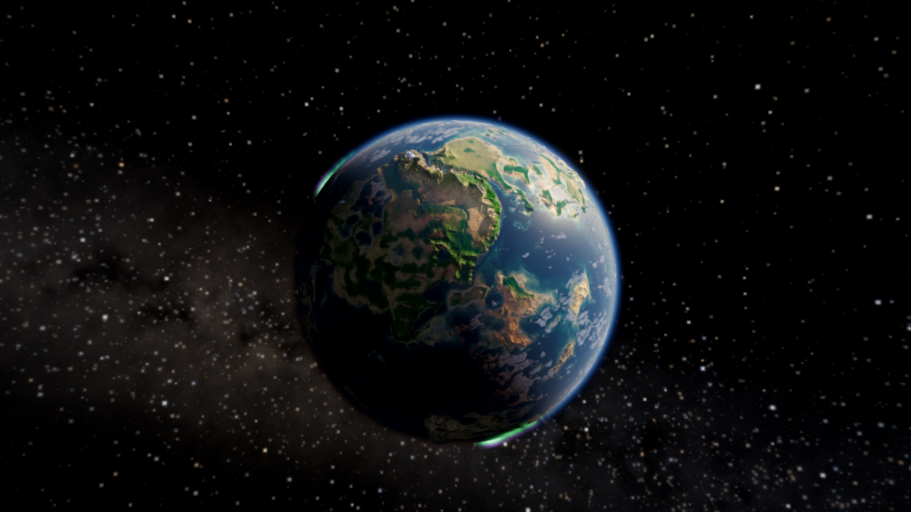 | 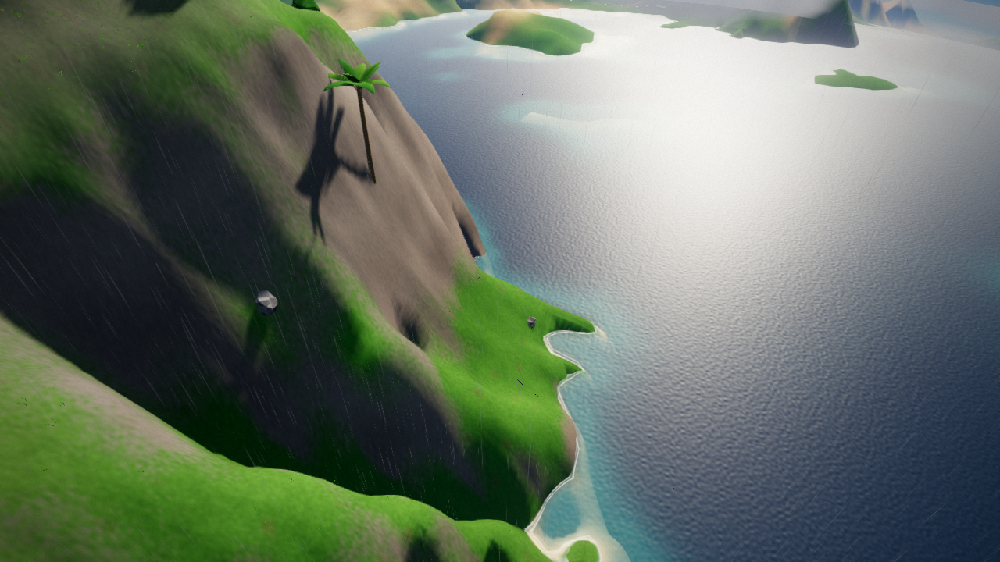 |
| 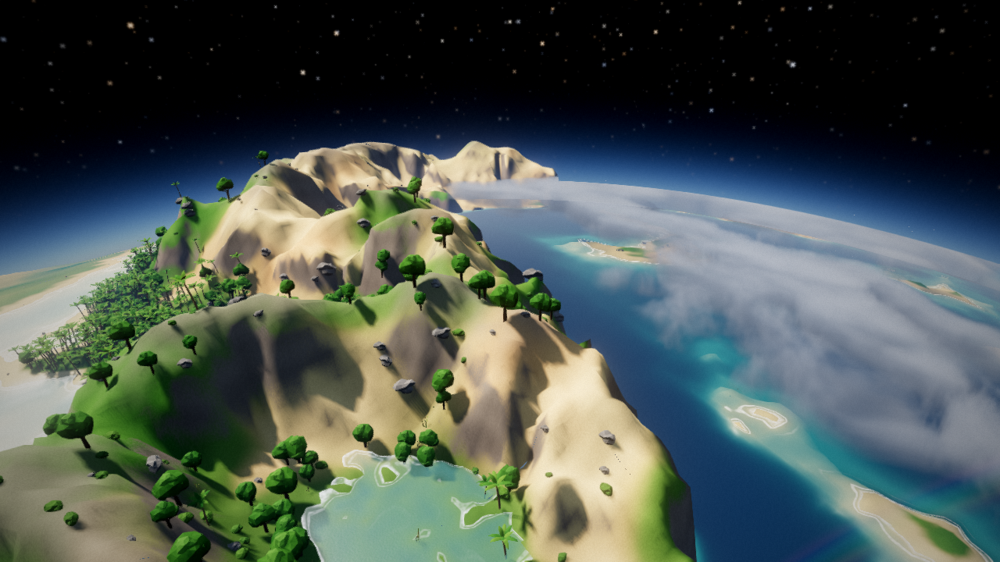 | 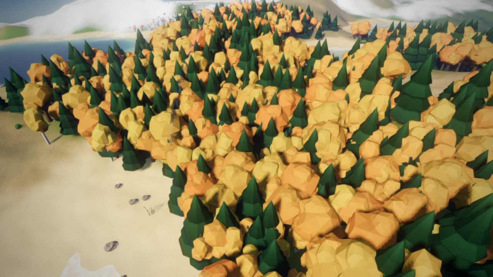 |
| 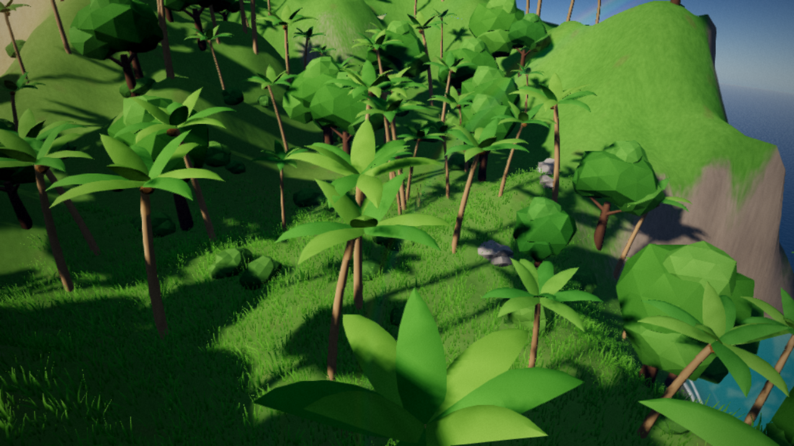 | 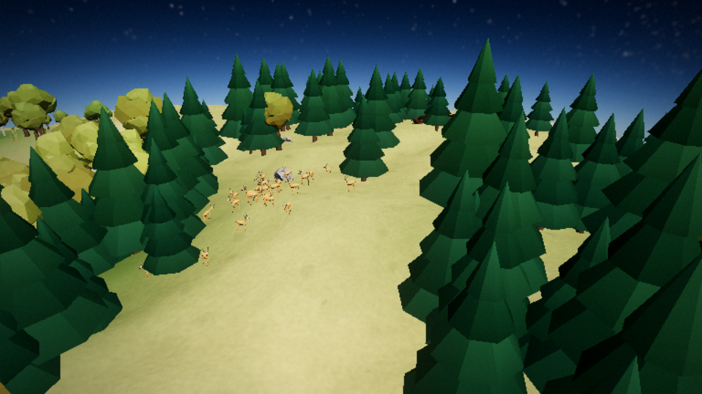 |
| 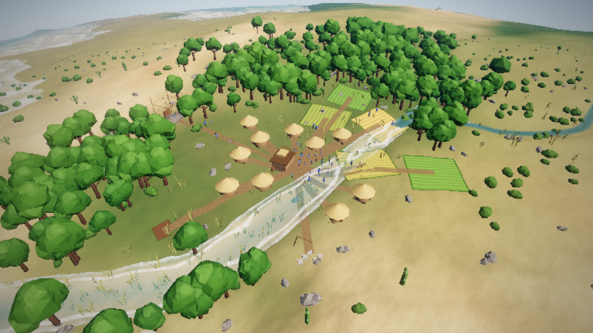 | 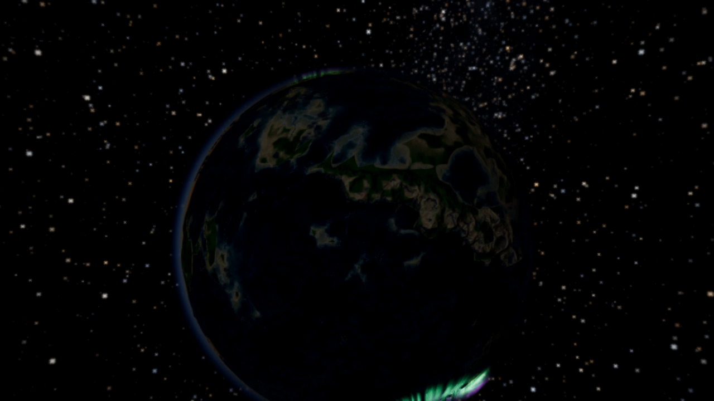 |
| 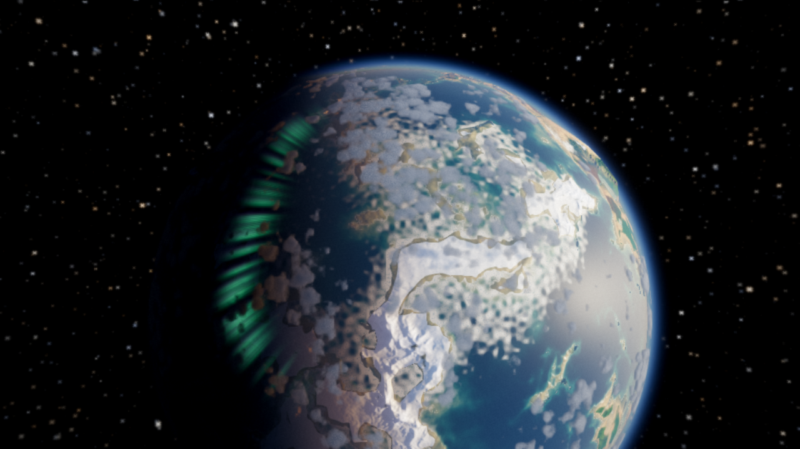 | 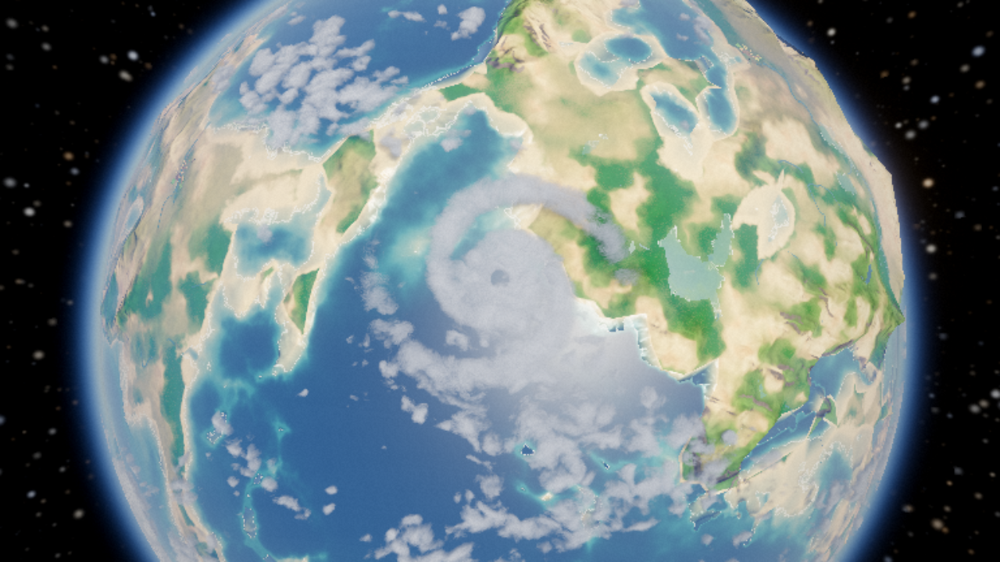 |
| 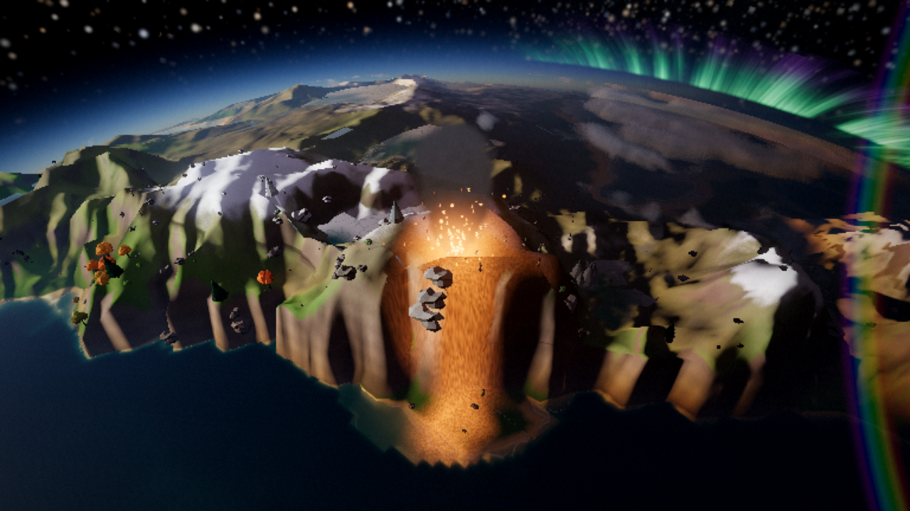 | 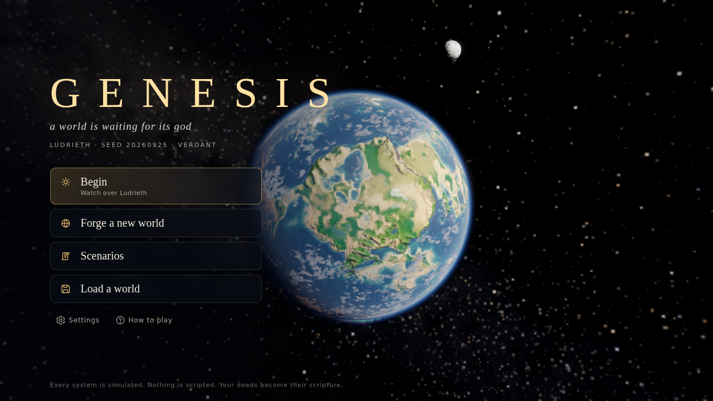 |
| 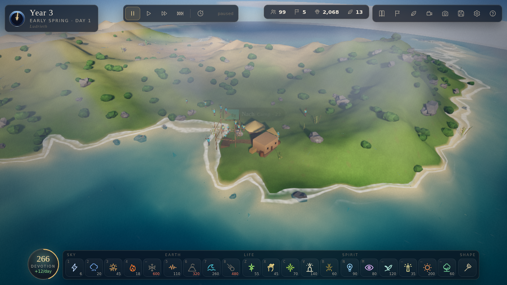 | 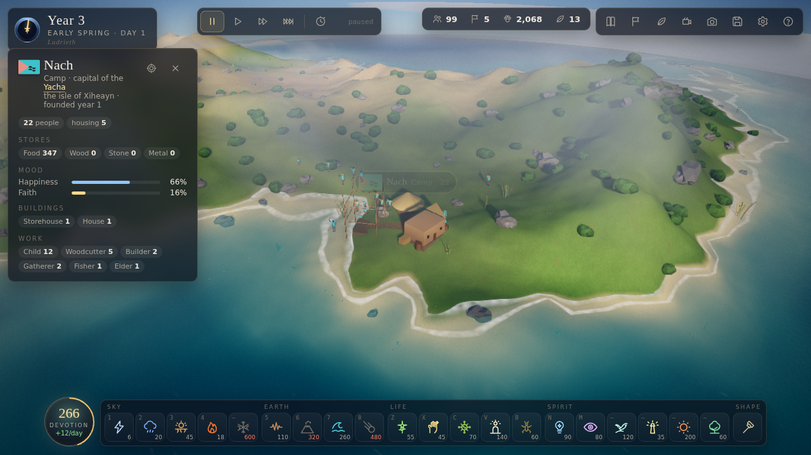 |
| 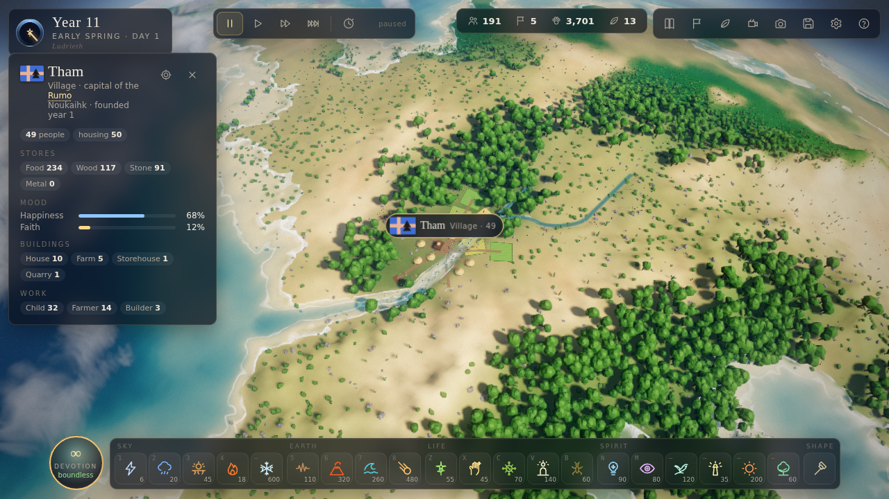 | 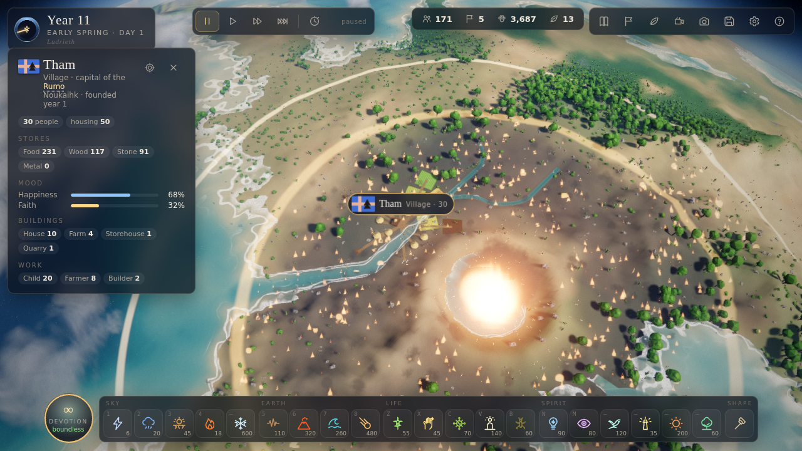 |
| 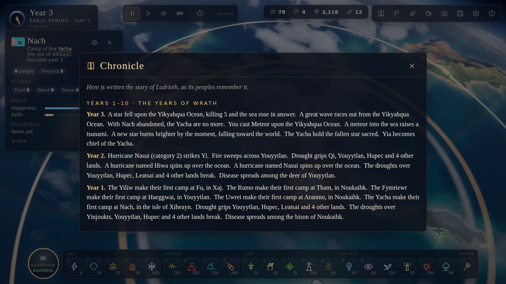 | 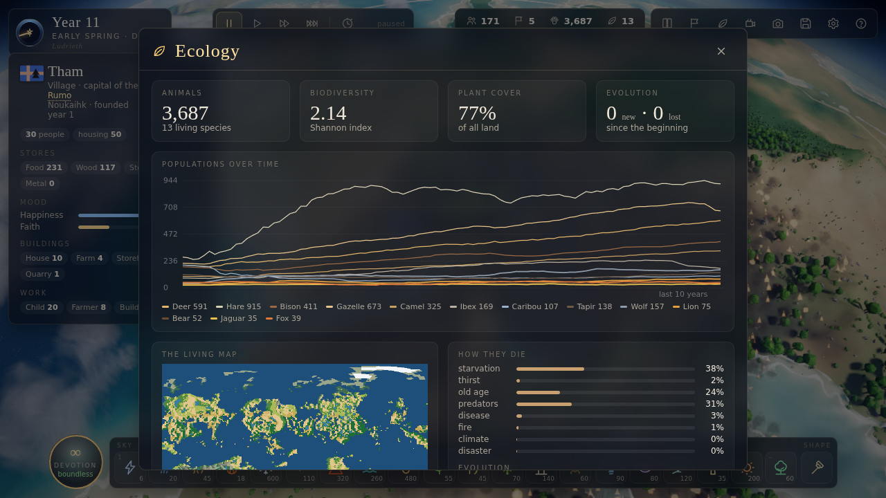 |

## How it is built

TypeScript (strict) + three.js + Vite. The simulation runs in a Web Worker on a
single seeded PRNG and is fully deterministic: the same seed and commands give the
same world, bit for bit, and a save continues exactly as the original would have.
The main thread only renders snapshots (instanced people, animals, buildings and
vegetation; CDLOD terrain; volumetric clouds and scattering in a post pass) and
plays procedural WebAudio. See [ARCHITECTURE.md](ARCHITECTURE.md),
[DECISIONS.md](DECISIONS.md) and [QUALITY_LOG.md](QUALITY_LOG.md); the final state
and measurements are in [FINAL_REPORT.md](FINAL_REPORT.md).
